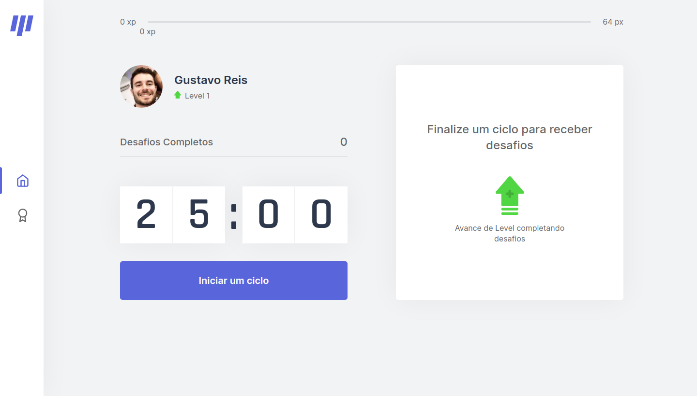
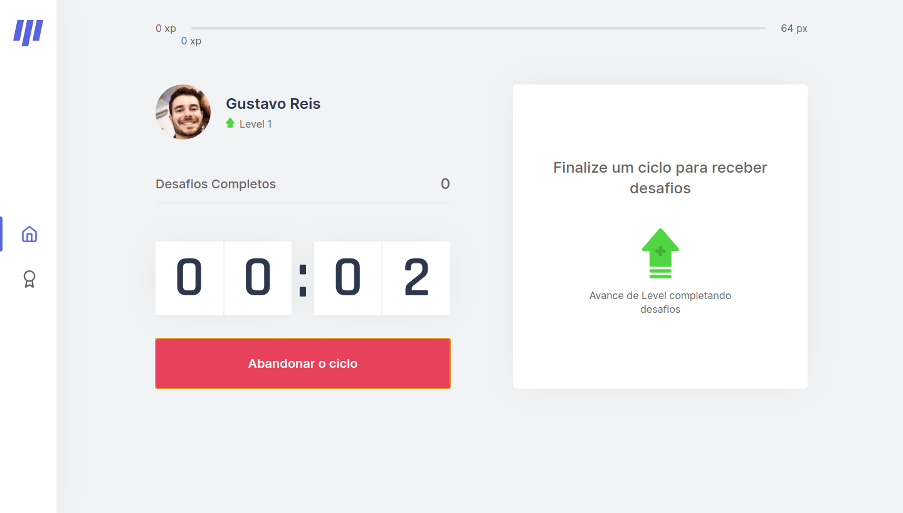
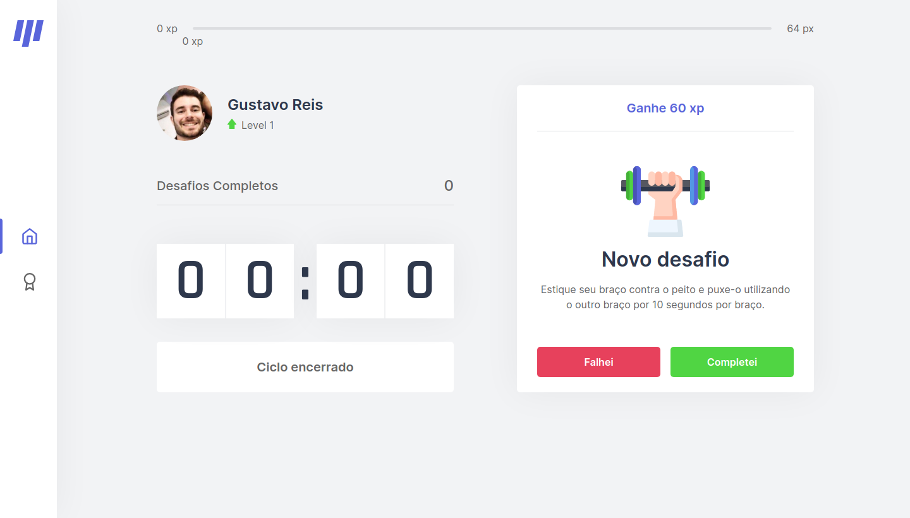
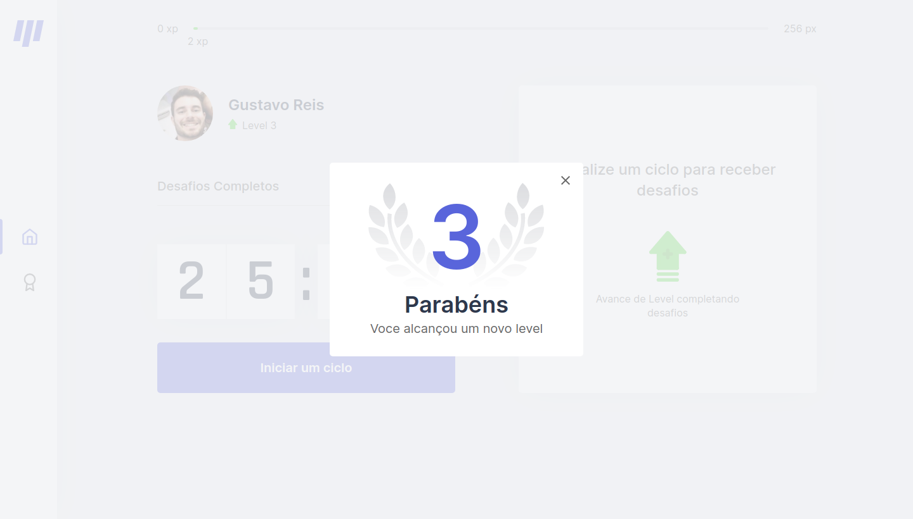

<p align="center">
   
</p>

<p align="center">
   <a href="https://www.linkedin.com/in/gustavo-reis-496b4a12a/">
      
   </a>
  
  
</p>

<h1 align="center">
  <div style="display: flex; flex-direction: row;">
  	
        
  <div>
  <div style="display: flex; flex-direction: row;">
  	
  	
  <div>
  <div style="display: flex; flex-direction: row;">
  	
  	
  <div>
</h1>

<h4 align="center"> 
	🚧 Move.it | NLW#4 | Loading...  🚧
</h4>

<h2 id="objective" > 🎯 Objective </h2>

Move.it was developed for time management based on the pomodoro technique, dividing the work into 25-minute periods, and a challenge is proposed in its intervals, which consists of an exercise aimed at helping those who spend a lot of time working in front of a computer. Each challenge has its XP points and, accumulating the points, you level up.

The layout of original move.it is available <a href="https://www.figma.com/file/wXWU7KGGF0Vw2QzFKwbJ2K/Move.it-2.0-(Copy)?node-id=160%3A2761">here</a>.

<h2 id="technologies"> 🛠 Technologies </h2>

The following tools were used in the construction of the project:

- [ReactJS](https://reactjs.org)
- [NextJS](https://nextjs.org)
- [Yarn](https://yarnpkg.com) or [Npm](https://www.npmjs.com)

<h2 id="usage" > 👷 Usage </h2>

Required! Install git, node and yarn (or npm).

```bash
# Clone Repository
$ git clone https://github.com/ghdreis/moveit-nlw.git

# Go to server folder
$ cd moveit-nlw

# Install Dependencies
$ yarn

# Run Aplication
$ yarn dev

# Access localhost
http://localhost:3000
```
<h2 id="author"> Author </h2>


By Gustavo Reis 👋🏽 Find me:

[](mailto:gusteve.henri@gmail.com)

<h2 id="license"> 📝 License </h2>

This project is under the MIT license.
